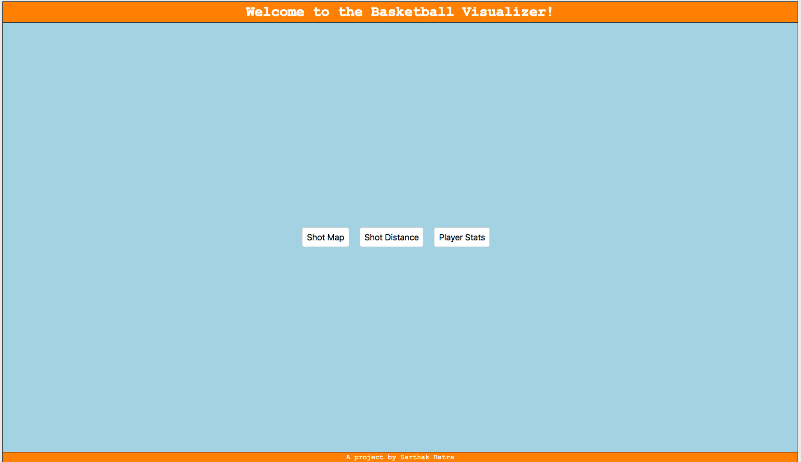

# BasketballStatsVisualizer

This project uses D3 to visualize player shot data and other basketball statistics

#### Home Page


## Getting Started
The tools below will help you get the most out of this project. If you have little D3 or Python experience, you can find plenty of resources on the internet to learn how to execute a Python file, clone a Github project on your local machine, or use external micrframeworks like [Flask](http://flask.pocoo.org/). Here's a simple guide to help you install both Python 2.7 and Python 3.6 on [Windows 10](https://datascience.com.co/how-to-install-python-2-7-and-3-6-in-windows-10-add-python-path-281e7eae62a)

 - *Environment*: Project dependencies are listed [here](requirements.txt). To install, type the following code in your terminal. 

	```
	pip install -r requirements.txt to install project dependencies
	```

 - *Executing the Application*: To run the app, type the following code in your terminal.

	```
	python application.py
	```

## Further improvements 
- Make this project more dynamic and deploy it in a presentable manner.

## Contributing

Please shoot me an email at sarthakbatra1993@gmail.com with the title 'Contributing to BasketballStatsVisualizer' if you have suggestions on how to make it better through collaboration or would want to know more about pull requests.

## Authors

* **Sarthak Batra** - *Initial work* - [My Github](https://github.com/sarthakbatragatech)

## License

This project is licensed under the MIT License - see the [LICENSE.md](LICENSE.md) file for details